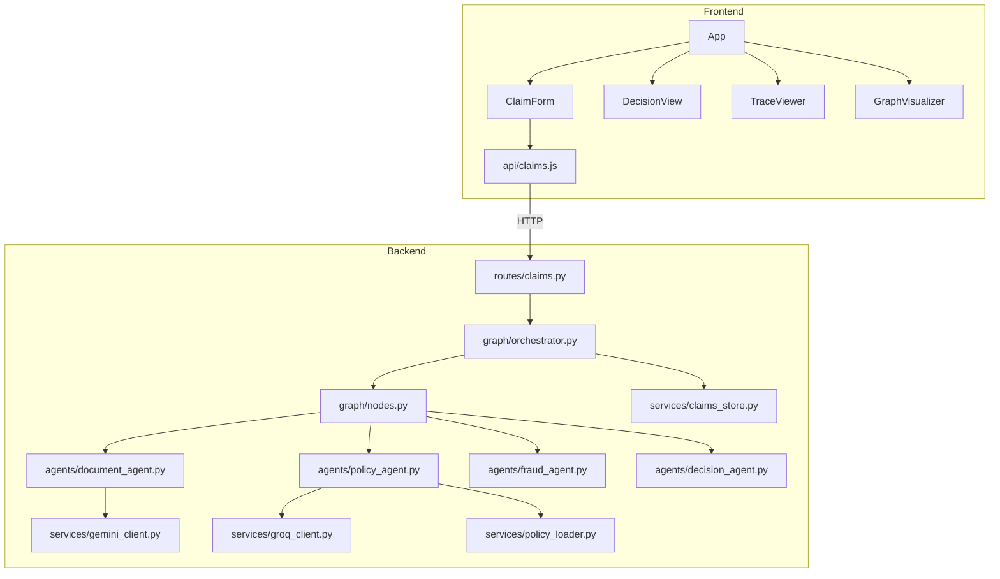

# Project Structure — Plum Claims Processing System

```
./ (repository root)
│
├── README.md                          # Project overview, quick start, test cases table
├── architecture.md                    # Full system architecture with diagrams
├── component_contracts.md             # Interface contracts for every component
├── deployment_and_testing_guide.md    # Deployment steps + 12 manual test scenarios
├── render.yaml                        # Render.com deployment configuration
├── .env                               # API keys (GITIGNORED — not in repo)
├── .gitignore                         # Git ignore rules
│
├── ARCHITECTURE_DECISIONS.md          # 12 ADRs — every design decision documented
├── TRADE_OFFS.md                      # Conscious trade-offs with rationale
├── FUTURE_ENHANCEMENTS.md            # Production roadmap & scaling strategy
├── ASSUMPTIONS_AND_LIMITATIONS.md     # All assumptions made + known limitations
├── TESTING_STRATEGY.md                # Three-tier testing approach
├── PROJECT_STRUCTURE.md               # This file
│
├── backend/
│   ├── main.py                        # FastAPI app entry point + SPA serving
│   ├── config.py                      # Pydantic Settings (env vars)
│   ├── requirements.txt               # Python dependencies (pinned versions)
│   ├── pyproject.toml                 # Python project metadata
│   ├── policy_terms.json              # Policy rules, coverage, members, thresholds
│   ├── test_cases.json                # 12 official test cases with expected outcomes
│   │
│   ├── agents/                        # Multi-agent system
│   │   ├── __init__.py
│   │   ├── base.py                    # BaseAgent ABC — _start_step(), _finish_step()
│   │   ├── document_agent.py          # 3-step pipeline: classify → quality → extract
│   │   ├── policy_agent.py            # 12 policy rule checks + financial calculation
│   │   ├── fraud_agent.py             # 5 weighted fraud signals (rule-based)
│   │   └── decision_agent.py          # Final decision synthesis
│   │
│   ├── graph/                         # LangGraph orchestration
│   │   ├── __init__.py
│   │   ├── orchestrator.py            # StateGraph builder + process_claim()
│   │   ├── nodes.py                   # Node wrappers + parallel_agents_node
│   │   └── edges.py                   # route_after_documents() conditional routing
│   │
│   ├── models/                        # Pydantic data models
│   │   ├── __init__.py
│   │   ├── claim.py                   # ClaimSubmission, ClaimResult, enums
│   │   ├── state.py                   # ClaimState TypedDict (LangGraph state)
│   │   ├── trace.py                   # ClaimTrace, AgentStep, CheckResult
│   │   └── policy.py                  # Policy type definitions
│   │
│   ├── services/                      # External service clients
│   │   ├── __init__.py
│   │   ├── gemini_client.py           # Google Gemini API (vision + text)
│   │   ├── groq_client.py             # Groq API (Llama 3.3 70B + vision fallback)
│   │   ├── policy_loader.py           # JSON policy file loader
│   │   └── claims_store.py            # In-memory claim storage
│   │
│   ├── routes/                        # API route handlers
│   │   ├── claims.py                  # CRUD endpoints for claims
│   │   └── health.py                  # Health check endpoint
│   │
│   ├── tests/                         # Test suite
│   │   ├── __init__.py
│   │   ├── test_agents.py             # 9 unit tests (freezegun + pytest-asyncio)
│   │   ├── test_cases_runner.py       # 12-case eval runner → eval_report.md
│   │   └── create_sample_docs.py      # Sample document image generator
│   │
│   └── sample_docs/                   # Sample document images for manual testing
│
├── frontend/
│   ├── index.html                     # HTML entry point
│   ├── package.json                   # React 18 + Vite 5
│   ├── vite.config.js                 # Vite build configuration
│   │
│   └── src/
│       ├── main.jsx                   # React DOM render
│       ├── App.jsx                    # Root component — state management
│       ├── index.css                  # Global styles (dark theme, animations)
│       │
│       ├── api/
│       │   └── claims.js              # API client (fetch wrappers)
│       │
│       └── components/
│           ├── ClaimForm.jsx          # Multi-step submission form
│           ├── DecisionView.jsx       # Decision result display
│           ├── TraceViewer.jsx        # Execution trace viewer
│           └── GraphVisualizer.jsx    # LangGraph path visualization
│
└── eval/
    └── eval_report.md                 # Generated eval report (12/12 passed)
```

---

## Key File Sizes

| File | Lines | Purpose |
|---|---|---|
| `document_agent.py` | 886 | Largest agent — handles 3 internal sub-steps + Gemini vision integration |
| `policy_agent.py` | 820 | 12 policy rule checks + financial calculation logic |
| `decision_agent.py` | 318 | Decision synthesis + confidence calculation |
| `fraud_agent.py` | 207 | 5 fraud signals with weighted scoring |
| `test_agents.py` | 277 | 9 comprehensive unit tests |
| `test_cases_runner.py` | 201 | Eval runner with markdown report generation |
| `index.css` | 382 | Complete dark-theme design system |
| `TraceViewer.jsx` | 268 | Most complex frontend component |

---

## Dependency Graph


